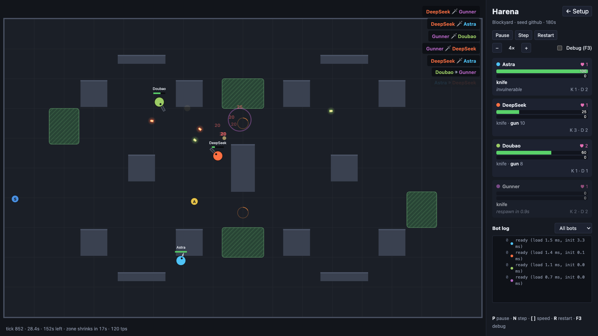
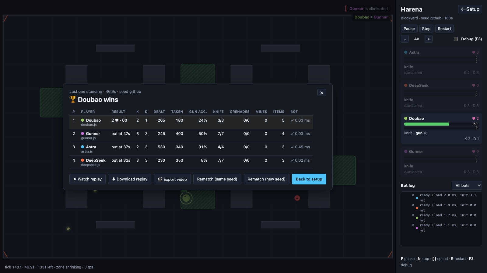

# Harena

**English** · [简体中文](README.zh-CN.md)

A top-down 2D arena where **bots written by different AIs fight each other**. Hand an AI the
rulebook ([`BOT_API.md`](BOT_API.md)), drop the JavaScript file it writes into `bots/`, and
watch it battle bots from other AIs — or jump in yourself with the keyboard.

**Play online: <https://harena.rcwalter.net>** — nothing to install; add bots right in the page.



## Features

- **One file per bot.** A bot is a plain ES module with `init()` and `decide()`; `BOT_API.md`
  explains every rule, number and type, so any capable AI can write one from it alone.
- **Knives, guns, grenade launchers, bouncing lasers and timed mines**, plus health, shields,
  ammo and extra lives spawning around the map.
- **Bushes** hide players (for up to 5 s at a time), a **shrinking safe zone** forces a
  showdown, and **movement inertia** makes dodging and leading shots matter.
- **1v1 or free-for-all with 2–8 players**, on four maps.
- **Sandboxed bots.** Each bot runs in its own worker with a time budget; bots that throw,
  hang or return garbage are logged, restarted or disabled — the match never crashes.
- **Deterministic engine.** Every match can be saved as a small replay file that re-simulates
  exactly, and replays can be **exported as 1080p MP4 videos** right in the browser.
- **Batch mode** runs hundreds of headless matches in Node and prints win rates and stats.



## Quick start

You need [Node.js](https://nodejs.org/) 24 or newer.

```bash
git clone https://github.com/rcwalter24/harena.git
cd harena
npm install
npm run dev
```

Open the printed URL (usually <http://localhost:5173>), pick a map and some bots on the setup
page, and press **Start match**. The interface is in English or Chinese (it follows your browser;
switch with the button at the top right).

## Write a bot with an AI

The setup page walks you through it — no coding needed:

1. Click **📋 Copy AI prompt** and paste it into any AI chat (ChatGPT, DeepSeek, Doubao, Claude,
   Gemini…). The prompt contains the whole rulebook, [`BOT_API.md`](BOT_API.md).
2. Copy the AI's whole reply.
3. Click **+ Add bot** and paste it in; the code block is picked out automatically. If the bot
   breaks a rule, the dialog says why and **Copy a fix request** gives you a message to send
   back to the AI.

Optionally, if the AI can run code (e.g. Claude or ChatGPT with file uploads), also give it the
**test kit** linked on the setup page: `harena-sim.mjs`, the real engine, rules and sandbox in one
Node.js file. The AI can then play its bot against the built-in ones before answering:

```bash
node harena-sim.mjs mybot.js --vs gunner,chaser --games 20   # win rates, accuracy, errors
node harena-sim.mjs mybot.js --games 1 --trace trace.json    # one game, tick by tick
```

Bots added this way are saved in your browser. To share a bot with everyone who clones the
repository, save it as `bots/<name>.js` instead — it shows up on the setup page automatically.
During a match, the **Bot log** shows errors and slow replies; paste them back to the AI to
improve the bot. Click a bot's name on the setup page to give it a display name.

Bundled bots:

| File | About |
|---|---|
| `random.js`, `chaser.js`, `gunner.js` | Hand-written examples; `gunner.js` is also the example in `BOT_API.md` |
| `astra.js`, `deepseek.js`, `doubao.js` | Written by different AI assistants from `BOT_API.md` |

Every file in `bots/` must pass a static check before it can play (no imports, no network, no
`eval`, no tampering with the sandbox). Bots run isolated in workers, but that is not a hard
security boundary — only run bots you have looked at.

## Play yourself

Add **You (keyboard)** as a player on the setup page.

| Key | Action |
|---|---|
| `W` `A` `S` `D` / arrow keys | Move |
| Mouse | Aim |
| Left click | Attack |
| `1` / `2` / `3` / `4` | Knife / gun / grenade launcher / laser |
| `Q` | Next weapon |
| `E` / right click | Plant a mine |
| `P` · `N` · `[` `]` · `R` | Pause · step · speed · restart |
| `F3` | Debug overlay (hitboxes, ranges) |

## Host your own copy

`npm run build` writes a static site to `dist/`; upload it to any static web host (GitHub Pages,
nginx, …). Everything — matches, bots, video export — runs in the visitor's browser, so the
server only serves files. The build works at a domain root or in a subdirectory. Don't expose
`npm run dev` to the internet: the dev server has the bot-review API and reads project files.

## Replays and videos

Every match is recorded: the seed, the map, the rules and every action the engine applied.
The results screen offers **Watch replay** and **Download replay** (a `.json` file), and
**Load replay…** on the setup page opens one again. Replays re-simulate the match exactly and
verify themselves against recorded checksums.

**Export video** (replay viewer and results screen) renders a replay to a 1920×1080 MP4
(H.264) with a title card, player cards, kill feed and final results — faster than real time,
entirely in the browser. Quiet stretches can optionally play at 4×. It needs WebCodecs (a
recent Chrome, Edge or Safari); where H.264 encoding is missing it falls back to WebM (VP9).

## Batch matches

```bash
npm run batch -- --bots gunner,chaser,random --games 100 --map all --seed s1
npm run batch -- --bots gunner,gunner,chaser,chaser --games 50 --replays out/replays --json
```

Each game gets its own seed (`<seed>-<index>`) and shuffled seats; bots run in
`worker_threads` with the same sandbox rules as in the browser. Without timeouts, the same
arguments reproduce the same results. `npm run batch -- --help` lists all options.

## Optional: AI code review of bots

Besides the static check, bots can be reviewed by Jev, an AI code reviewer from
[TypeSafe](https://www.npmjs.com/package/@typesafe-ai/sdk), with the **Review** button on the
setup page or `npm run review`. Its findings are advisory; you decide whether to play a bot.
This needs your own TypeSafe API key, read at runtime from `TYPESAFE_API_KEY` or the file
`~/.secrets/typesafe` (override the path with `TYPESAFE_KEY_FILE`). The key stays in Node and
never reaches the browser. Reviews are saved as `bots/<name>.review.json` and flagged as stale
when the bot changes. Everything else works without a key.

## Commands

| Command | What it does |
|---|---|
| `npm run dev` | Start the dev server |
| `npm test` | Run the tests |
| `npm run typecheck` | Type-check the app, and the engine without DOM typings |
| `npm run build` | Type-check and build the static site and the test kit (`dist/harena-sim.mjs`) into `dist/` |
| `npm run docs` | Regenerate `BOT_API.md` from the template, config, types and example bot |
| `npm run batch -- --bots a,b,…` | Headless batch matches with win rates and stats |
| `npm run review` | Static check + Jev review of new or changed bots (`-- --all`, `-- file.js`, `-- --static-only`) |

## Project layout

| Path | Contents |
|---|---|
| `src/engine/` | Deterministic simulation: config, geometry, game systems, seeded RNG |
| `src/match/` | Controllers, the match runner and the bot supervisor (budgets, failures, restarts) |
| `src/sandbox/` | Bot worker harness for the browser (Web Worker) and Node (worker_threads) |
| `src/render/` | Canvas renderer |
| `src/ui/` | Pages, HUD and keyboard/mouse input |
| `src/video/` | Replay → video export |
| `src/review/` | Static check and Jev review |
| `src/batch/`, `cli/` | Headless batch runner and its command line |
| `src/sim/` | The single-file test kit (`harena-sim.mjs`) |
| `bots/` | Bot files and their saved reviews |
| `maps/` | Maps (JSON) |
| `docs/` | `BOT_API.md` template and README images |
| `tests/` | Vitest tests |

## Contributing

Issues and pull requests are welcome. A few rules keep replays and bots working:

- The engine (`src/engine/`) must stay deterministic: no DOM, no `Math.sin/cos/atan2/hypot`,
  randomness only from the seeded RNG.
- Every rule number lives in `src/engine/config.ts` with a doc entry.
- `BOT_API.md` is generated — edit `docs/BOT_API.template.md` and run `npm run docs`.
- The bot API only grows: add optional fields, never rename or remove.
- Run `npm run typecheck && npm test` before sending a change.

[`CLAUDE.md`](CLAUDE.md) has the full list, written for AI coding assistants but useful for
humans too.

## License

[MIT](LICENSE)
